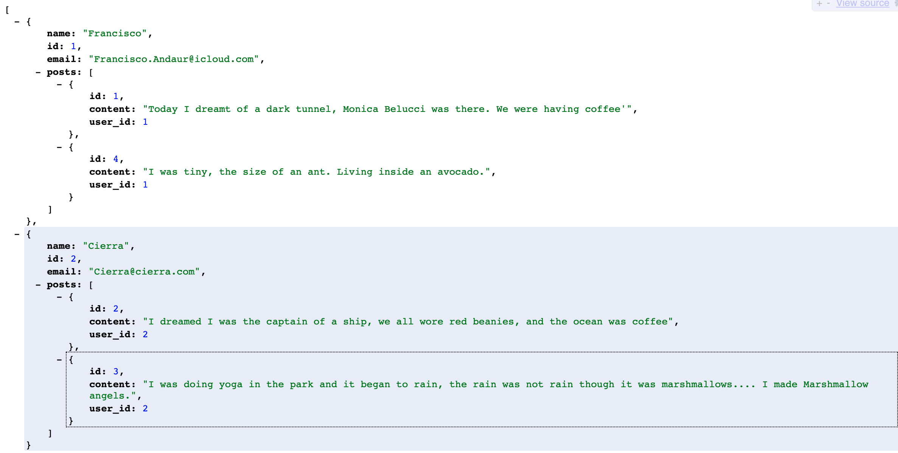

###### first make sure to have rails installed. instructions [here](https://guides.rubyonrails.org/getting_started.html "Installing Rails")

## How to install
<p>The purpose of this repo is to create a server for the web DEVDREAM.  and to store user information.</p>

1. cd into the project and type this into the terminal ```bundle install```
 ><em>you might get some errors here, try this if you do ```gem pristine --all```</em>
2. type this ```rails db:setup``` on the terminal to setup backend server
3. type this ```rails s``` on the terminal to start the server. 
asdf
4. go to [localhost:3000](http://localhost:3000/users "LocalHost") if you get a JSON file back, it should be working fine.

Time to RUN the front end.  let's go [here](https://github.com/FranciscoAndaur/DevDream "DEVDREAM") to clone the DEVDREAM
